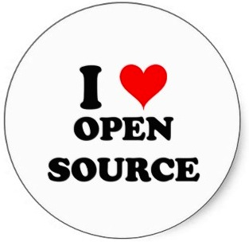
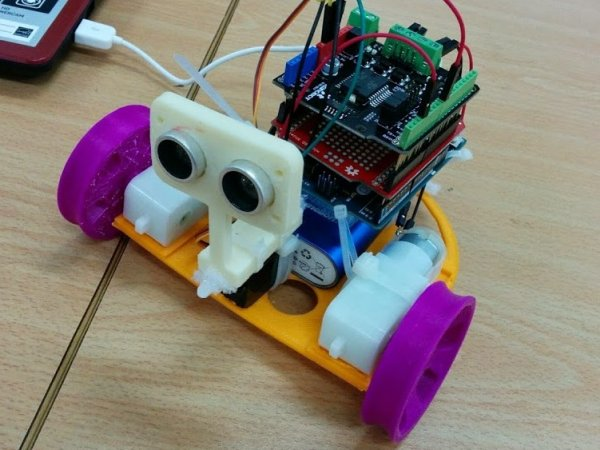
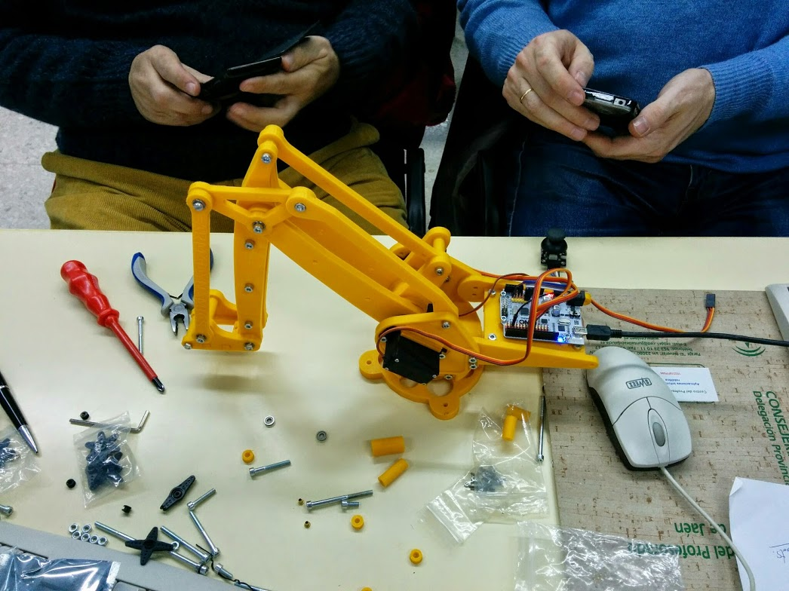
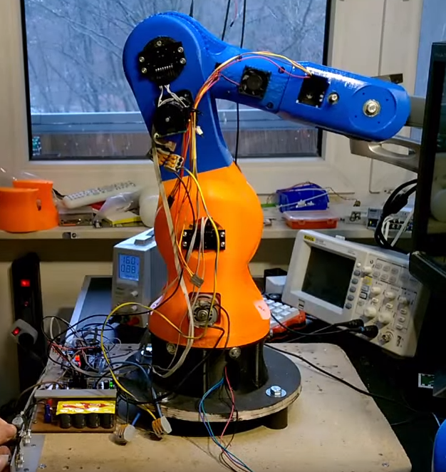
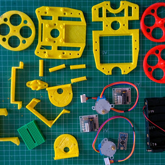

# ILO

###[TecnoCole](http://www.tecnocole.com)

!

## \#ILoveOpen

Lo "Open" es diverso

!

## \#ILoveOpen

Lo "Open" es diverso

!

## \#ILoveOpen

Lo "Open" es diverso y de todos

!

## \#ILoveOpen

### EveryBody <3 Open Source

!

## \#ILoveOpen

Desde lo pequeño

!

## \#ILoveOpen

Desde lo pequeño

!

## \#ILoveOpen

Hasta lo grande

!

## \#ILoveOpen

Hasta lo ¡¡increible!!

!

## \#ILoveOpen

Y todo open, libre

!

## \#ILoveOpen

De todos

